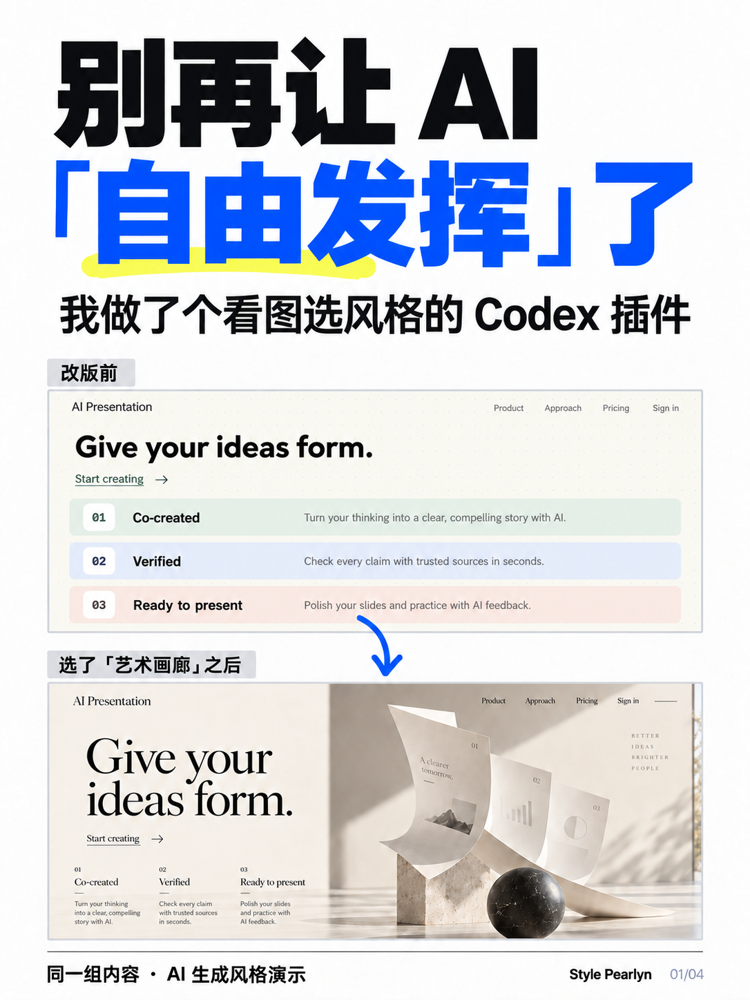
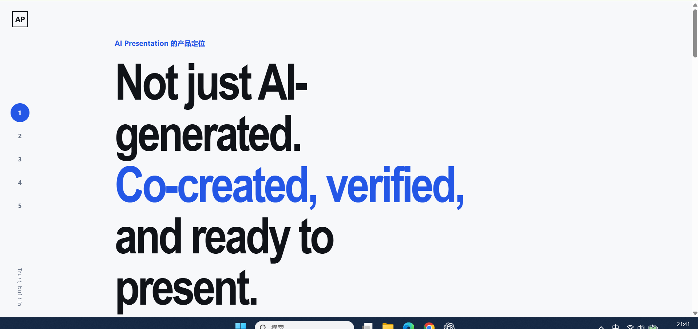
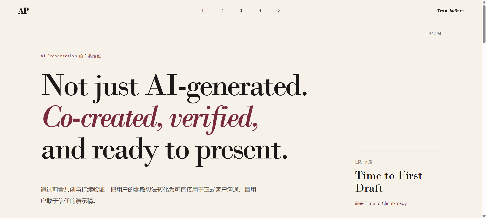
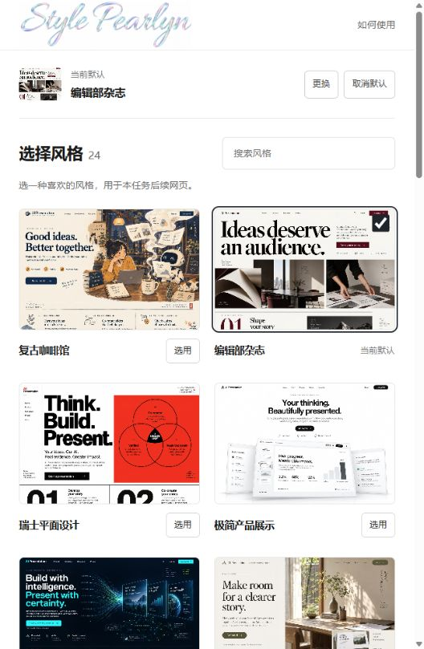
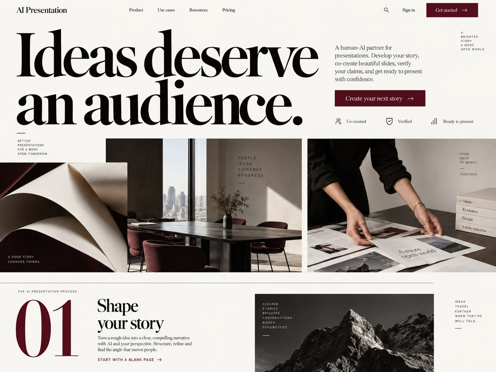
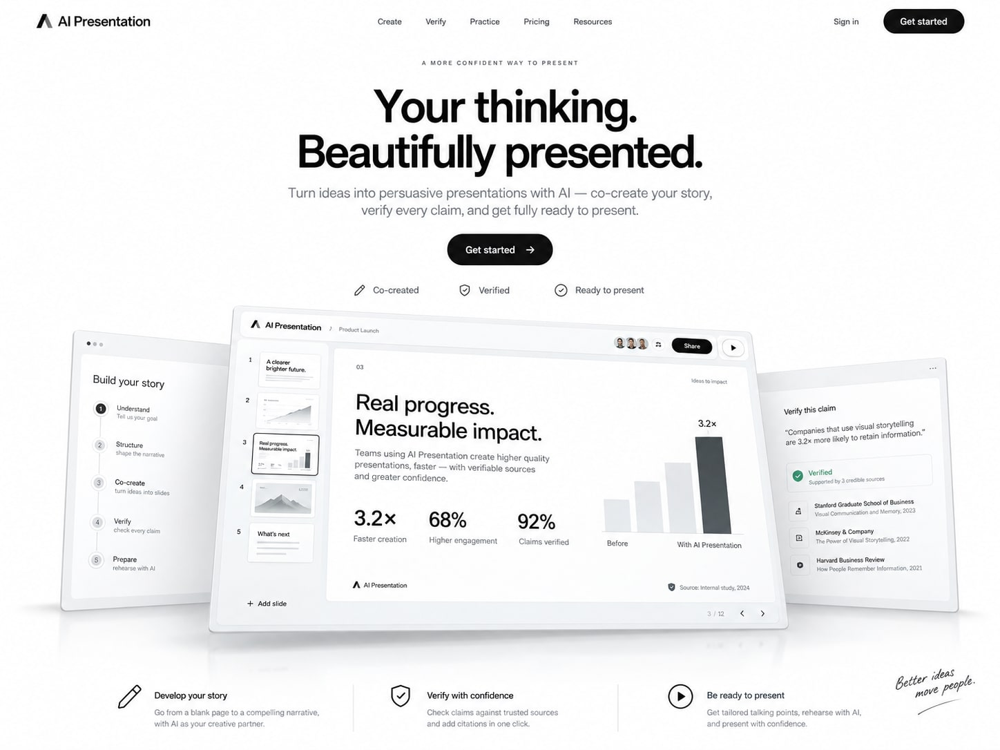
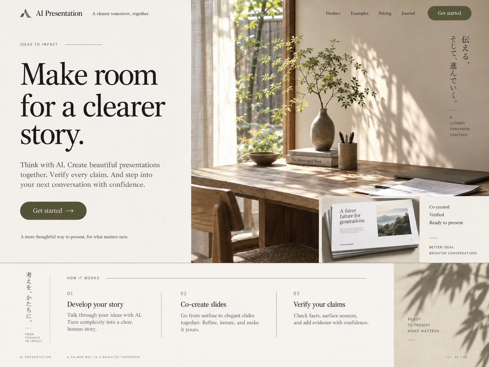
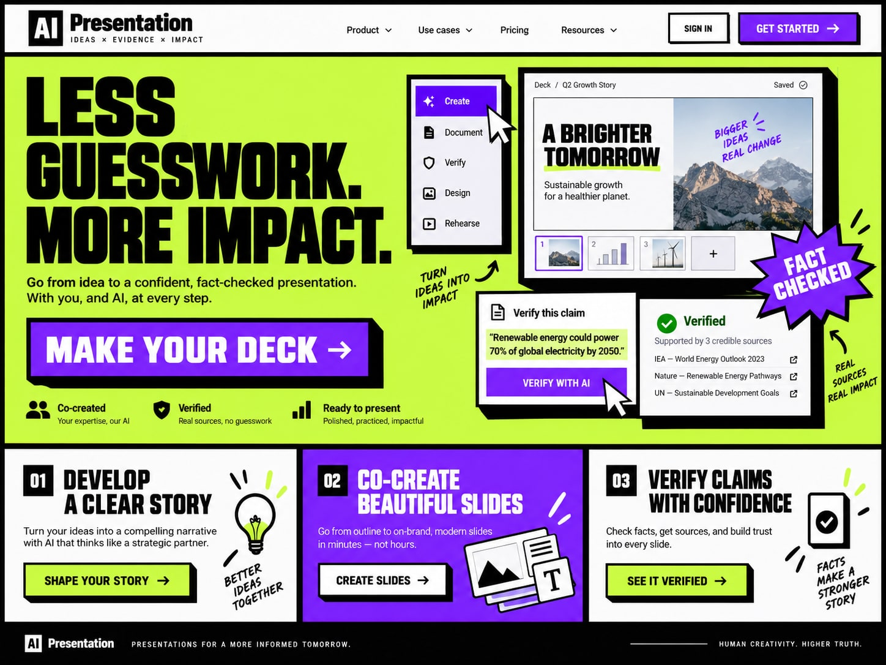

主图为 AI 生成的风格演示，展示同一组内容的两种视觉方向；不是插件运行的实测截图。

<h1 align="center">Style Pearlyn</h1>

<strong>不用想怎么描述设计。选一张图，让 Codex 接着做。</strong>

24 种视觉风格 · 已有 HTML 改版 · 当前任务默认风格

<a href="#result">看效果</a> · <a href="#install">安装</a> · <a href="#usage">开始使用</a> · <a href="#styles">浏览风格</a> · <a href="#faq">常见问题</a>

Style Pearlyn 是一个面向 <strong>Codex 本地任务</strong>的视觉风格插件。它把“高级一点”“有杂志感”“像温暖的咖啡馆”变成一张张可以直接选择的参考图，帮助你给已经生成的网页完成最后一步视觉排版，也可以在动手之前先确定风格。

<h2 id="result">实际改版案例</h2>

查看「编辑部杂志」风格的真实 HTML 改版前后

<table>
<tr><th width="50%">改版前</th><th width="50%">选择「编辑部杂志」后</th></tr>
<tr><td></td><td></td></tr>
</table>

以上为同一份 HTML 的实际改版截图。插件引导 Codex 保留原有内容与功能，调整配色、字体、间距和必要布局，并另存结果。具体效果取决于输入网页、模型和任务要求。

<h2>从“说不清”到“选得出”</h2>
<table>
<tr><th>你想做的事</th><th>Style Pearlyn 怎么帮你</th></tr>
<tr><td>已有网页，想换一种视觉表达</td><td>上传 HTML，看图选风格，由 Codex 返回改好的文件。</td></tr>
<tr><td>准备生成网页，先确定方向</td><td>设为当前任务默认风格，之后再描述内容与功能。</td></tr>
<tr><td>试过一种，想换个感觉</td><td>在面板中直接重选；也可以点击「更换」或「取消默认」。</td></tr>
</table>

不需要复制长提示词，也不需要记风格编号。每种风格只有一张主参考图，让选择更直接。

<h2 id="install">安装</h2>

<strong>需要：</strong>支持本地插件的 Codex 桌面环境，以及完整 Python 3.9+。当前在 Windows 验证；macOS 和 Linux 尚未验证。插件无需额外 API Key，不需要部署服务器，也不依赖第三方 Python 包。Codex 自身的使用条件仍然适用。

<h3>让 Codex 帮你安装</h3>

在 Codex 本地任务中发送：

<blockquote>请从 https://github.com/caesarshi2522/style-pearlyn 安装 Style Pearlyn 插件，将仓库添加为插件源，并安装 style-atlas@style-pearlyn。</blockquote>

也可以下载到本地再安装：

<ol>
<li>在此 GitHub 仓库点击 <strong>Code → Download ZIP</strong>，解压并保留完整目录。</li>
<li>在 Codex 本地任务中提供解压目录路径，并发送下面这句话。</li>
<li>安装并启用后，新建一个任务开始使用。</li>
</ol>
<blockquote>请安装这个文件夹里的 Style Pearlyn 插件。仓库根目录包含 .agents/plugins/marketplace.json，请添加该本地插件源，并安装 style-atlas@style-pearlyn。不要覆盖我的其他插件。</blockquote>

使用终端安装

先进入解压后的仓库根目录，再执行：

<pre><code>codex plugin marketplace add .
codex plugin add style-atlas@style-pearlyn</code></pre>

如果当前版本不支持第二条命令，请在应用的插件目录中选择 <code>style-pearlyn</code> 来源并安装 Style Pearlyn。安装方式见 <a href="docs/INSTALL.md">详细说明</a>。

<h2 id="usage">开始使用</h2>
<h3>① 给已有 HTML 换风格</h3>
<ol>
<li>在 Codex 对话中上传 HTML，或直接使用当前任务已经生成的 HTML。</li>
<li>发送：<strong>“用 Style Pearlyn 给这个 HTML 换个风格。”</strong></li>
<li>在图片面板点击喜欢的风格旁的<strong>「选用」</strong>，保持任务运行，等待对话返回新文件。</li>
</ol>

原文件保留；结果另存为带 <code>-pearlyn</code> 后缀的 HTML。如果网页依赖独立 CSS、JS 或图片，请一并提供。

<h3>② 先定风格，再生成</h3>
<ol>
<li>发送：<strong>“先用 Style Pearlyn 选一个默认风格。”</strong></li>
<li>在面板点击<strong>「选用」</strong>，看到“当前默认”后回到对话。</li>
<li>描述需求，例如：<strong>“帮我做一个摄影作品集首页。”</strong></li>
</ol>

默认风格用于当前任务后续生成的 HTML。它不会改写已有网页，也不会自动影响其他任务或设备。想换风格时，直接在面板重选或点击顶部「更换」；不想沿用时点击「取消默认」。

<h2 id="styles">24 种风格，用图片来选</h2>

从克制的极简，到温暖的插画，再到鲜明的实验风格。下面展示其中六种；完整图片库随插件提供。

<table>
<tr><td width="33%"> <strong>复古咖啡馆</strong></td><td width="33%"> <strong>编辑部杂志</strong></td><td width="33%"> <strong>极简产品展示</strong></td></tr>
<tr><td> <strong>玻璃质感</strong></td><td> <strong>日式生活方式</strong></td><td> <strong>新粗野主义</strong></td></tr>
</table>

查看全部风格名称

复古咖啡馆 · 编辑部杂志 · 瑞士平面设计 · 极简产品展示 · 深色科技 · 日式生活方式 · 复古报纸 · 大胆几何 · 新粗野主义 · 艺术画廊 · 手账拼贴 · 专业工作台 · 玻璃质感 · 柔软 3D · 优雅轻奢 · 清爽商务 · 可爱卡通 · 国风水墨 · 像素复古 · Y2K 潮流 · 终端代码 · 自然有机 · 电影叙事 · 柔彩渐变

<h2 id="faq">常见问题</h2>

为什么「选用」按钮不能点击？

改版模式需要先在 Codex 对话中上传 HTML，并让 Codex 连接当前文件。仅想选默认风格时，使用“先用 Style Pearlyn 选一个默认风格”，无需上传文件。独立浏览页不能代替任务连接。

点击后为什么没有继续生成？

已有 HTML 的改版需要 Codex 任务正在等待选择。任务结束或面板断开时，回到同一个任务说“继续用 Style Pearlyn 给这个 HTML 换风格”。默认风格的更换只保存设置，不会自动重做网页或唤醒对话。

应用风格要多久？

选图提交和 HTML 改写是两个阶段。总耗时取决于模型、页面复杂度、资源和验证范围，目前没有经过统一测试的耗时承诺。

可以在 ChatGPT 普通聊天、Claude 或豆包里用吗？

当前版本针对 Codex 本地任务。尚未提供这些客户端的适配，不保证直接安装可用。

是不是完全离线？

图库面板在本机运行，没有独立账号、统计脚本或云端数据库；HTML 的阅读与生成仍由 Codex 完成，适用其服务与账号的数据设置。详见 <a href="docs/PRIVACY.md">文件与隐私</a>。

<h2>项目说明</h2>

当前为可供体验的版本。已验证 Windows 本地工作流，尚未覆盖全新设备安装、多种复杂站点兼容性和所有无障碍场景。它通过视觉参考指导 Codex 修改 HTML，不是自动替换整站主题的引擎。

源码、图片与第三方字体的说明见 <a href="docs/USAGE-AND-ASSETS.md">使用与素材说明</a>。当前尚未指定通用开源许可证。参考图为 AI 生成的风格示意，请勿把其中的品牌、文案和数据当作自己的网页内容。

遇到问题可以在本仓库提交 Issue，说明系统、Codex 版本、使用场景和复现步骤；请勿上传含个人信息的 HTML 或会话文件。

<strong>Choose the look. Keep creating.</strong> Style Pearlyn · 为网页选一种风格

